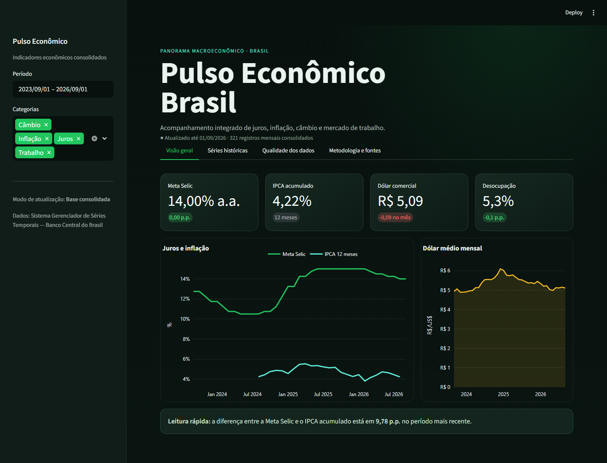
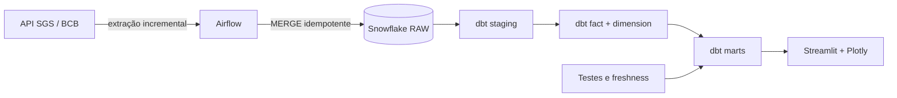

# Pulso Econômico Brasil

Plataforma de dados que transforma séries públicas do Banco Central do Brasil em métricas econômicas documentadas, testadas e prontas para consumo.

O objetivo é demonstrar um fluxo completo e proporcional ao problema: ingestão incremental com Airflow, armazenamento no Snowflake, transformação e qualidade com dbt e uma aplicação pública em Streamlit + Plotly.



## Arquitetura



## Camada de dados e controles

O foco não está apenas em transportar dados. O projeto explicita:

- Grão da tabela fato: uma observação por série e data.
- Catálogo governado de indicadores em uma dimensão dbt.
- Modelo incremental com chave única e estratégia `merge`.
- Mart mensal certificado e mart executivo com métricas derivadas.
- IPCA acumulado em 12 meses e spread entre Selic e inflação definidos em SQL.
- Testes de unicidade, nulidade, relacionamentos, faixas válidas e freshness.
- Exposure dbt ligando os marts ao dashboard.
- Base consolidada que mantém a aplicação disponível sem consumir Snowflake a cada visita.

## Indicadores do MVP

| Indicador | Código SGS | Frequência | Uso analítico |
|---|---:|---|---|
| Meta Selic | 432 | diária | valor no fim do mês |
| IPCA | 433 | mensal | variação mensal e acumulado em 12 meses |
| Dólar comercial | 1 | diária | média e fechamento mensal |
| Taxa de desocupação | 24369 | mensal | valor mensal publicado |

Fonte: [Sistema Gerenciador de Séries Temporais do Banco Central do Brasil](https://dadosabertos.bcb.gov.br/).

## Estrutura

```text
app/                         aplicação Streamlit e snapshot público
data_pipeline/               projeto dbt
  models/economic/           staging, fato, dimensão e marts
  seeds/economic_series.csv  catálogo dos indicadores
dbt_dag/                     projeto Astro/Airflow
  dags/economic_analytics_dag.py
  include/economic_pipeline/ cliente BCB e carga Snowflake
scripts/                     atualização do snapshot e carga local
tests/                       testes unitários e smoke test da aplicação
```

## Executar o dashboard

```powershell
python -m venv .venv
.venv\Scripts\Activate.ps1
pip install -r requirements.txt
python scripts\refresh_economic_snapshot.py
streamlit run app\streamlit_app.py
```

A aplicação abre em `http://localhost:8501` usando a base consolidada incluída no projeto.

## Carregar o Snowflake e construir os marts

O script usa variáveis `SNOWFLAKE_*` ou o profile `data_pipeline` em `~/.dbt/profiles.yml`. Credenciais não devem ser commitadas.

```powershell
python scripts\load_bcb_to_snowflake.py
cd data_pipeline
dbt deps
dbt build --select +tag:economic
dbt source freshness --select source:bcb_raw
```

A carga consulta uma janela móvel de 120 dias e executa `MERGE` pela combinação `series_code + observation_date`. Reexecuções com os mesmos valores não geram duplicidades.

## Executar com Airflow

Dentro de `dbt_dag/`:

```powershell
astro dev start
```

A DAG `economic_analytics_pipeline` executa diariamente:

1. Extração das quatro séries do BCB.
2. Carga idempotente em `DBT_DB.RAW.BCB_SERIES`.
3. Construção e teste dos modelos econômicos pelo Cosmos/dbt.

## Modos de dados do Streamlit

- `snapshot` é o padrão local e lê `app/data/economic_monthly.csv`.
- `live` consulta `DBT_DB.DBT_SCHEMA.MART_ECONOMIC_MONTHLY`, com cache de uma hora.

No deploy, copie `app/.streamlit/secrets.toml.example` para o gerenciador de segredos do Streamlit e substitua as credenciais. Se o Snowflake estiver indisponível, a aplicação volta automaticamente para a última base consolidada.

O dashboard consulta os marts, mas não executa a carga por conta própria. A atualização automática depende da DAG do Airflow estar rodando em um ambiente ativo; executar apenas o deploy do Streamlit publica a camada de visualização.

## Validação

```powershell
pytest tests -q
cd dbt_dag
astro dev parse
```

O workflow de CI executa os testes Python, o smoke test do Streamlit e `dbt parse` sem acessar credenciais reais.
