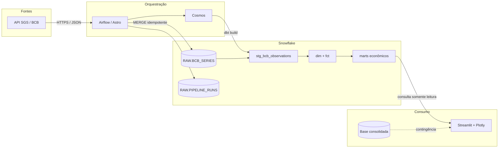
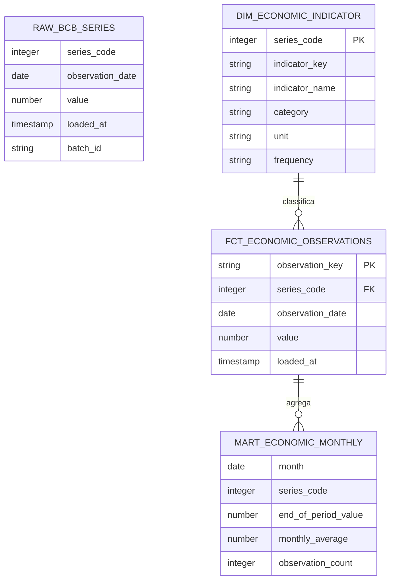
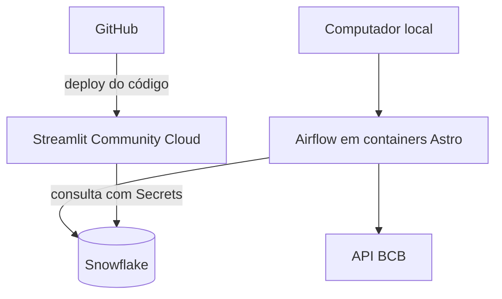

# Arquitetura — Pulso Econômico Brasil

## Visão geral

O sistema transforma séries públicas do Banco Central do Brasil em métricas econômicas mensais, validadas e disponibilizadas em um dashboard público.

## Componentes e responsabilidades

| Componente | Responsabilidade |
|---|---|
| API SGS/BCB | Fonte oficial das séries econômicas |
| Airflow | Agenda, dependências, tentativas e estado das execuções |
| Loader Python | Extração, normalização inicial e carga idempotente |
| Snowflake RAW | Persistência das observações de origem e auditoria das cargas |
| dbt | Transformações SQL, modelagem, testes, documentação e linhagem |
| Cosmos | Converte a seleção de modelos dbt em tarefas do Airflow |
| Marts | Contrato estável para consumo analítico |
| Streamlit + Plotly | Interface pública, filtros, indicadores e visualizações |
| GitHub Actions | Testes Python e validação estática do projeto dbt |

## Modelo de dados

### Granularidade

- `RAW.BCB_SERIES`: uma linha por série e data de observação.
- `dim_economic_indicator`: uma linha por indicador.
- `fct_economic_observations`: uma linha por indicador e data.
- `mart_economic_monthly`: uma linha por indicador e mês.
- `mart_economic_dashboard`: uma linha por mês com as métricas executivas.

## Decisões de arquitetura

### Carga idempotente

A chave natural `series_code + observation_date` controla o `MERGE` no Snowflake. Reprocessar o mesmo intervalo não cria duplicidades; valores revisados pela fonte são atualizados.

### Processamento incremental

A ingestão relê uma janela móvel de 120 dias. A tabela fato também é incremental e usa uma pequena sobreposição por `loaded_at`, permitindo capturar correções sem reconstruir todo o histórico.

### Regras fora da visualização

Agregações e métricas ficam nos modelos dbt. O dashboard consome os marts e não replica a lógica de transformação, reduzindo divergências entre análises.

### Qualidade antes do consumo

Os modelos possuem testes de unicidade, nulidade, relacionamento, combinações de chaves, faixas válidas e freshness. A aplicação está registrada como exposure dependente dos marts.

### Continuidade da interface

O modo principal consulta o Snowflake. Se essa conexão falhar, o Streamlit usa a última base consolidada e identifica o modo de contingência na tela.

## Topologia de execução atual

O dashboard e o Snowflake estão acessíveis na nuvem. O Airflow, porém, roda localmente. Portanto, o scheduler só executa enquanto o computador e os containers estiverem ativos. Uma operação 24/7 exigiria hospedar o Airflow em infraestrutura sempre disponível.

## Segurança

- Credenciais não são versionadas no GitHub.
- O Airflow usa a conexão `snowflake_conn`.
- O Streamlit recebe credenciais pelo gerenciador de Secrets da plataforma.
- Identificadores de banco e schema são validados antes da composição da consulta.
- A aplicação executa somente leitura sobre o mart mensal.

## Documentos relacionados

- [Fluxo de dados e atualização](data-flow.md)
- [README principal](../README.md)
