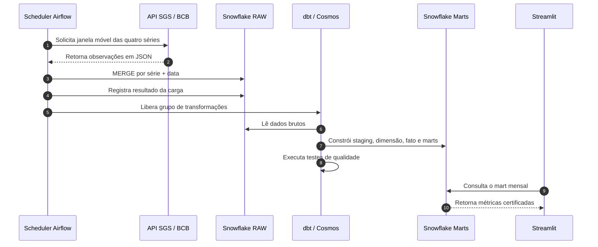

# Fluxo de dados e atualização — Pulso Econômico Brasil

## Fluxo ponta a ponta



## Etapas da execução

### 1. Disparo

A DAG `economic_analytics_pipeline` está configurada com a expressão cron `0 6 * * *`, correspondente a uma execução diária às **06:00** no fuso `America/Recife`.

O Airflow usa `catchup=False`, evitando a criação automática de execuções históricas, e permite até duas novas tentativas em caso de falha.

### 2. Extração

A tarefa `ingest_bcb_series` consulta:

| Série | Código | Frequência publicada |
|---|---:|---|
| Meta Selic | 432 | diária |
| IPCA | 433 | mensal |
| Dólar comercial | 1 | diária |
| Taxa de desocupação | 24369 | mensal |

Na primeira carga, o histórico começa em 2020. Nas execuções seguintes, o processo relê até 120 dias anteriores à observação mais recente para incorporar revisões da fonte.

### 3. Carga no Snowflake

As observações são carregadas em uma tabela temporária e depois consolidadas em `DBT_DB.RAW.BCB_SERIES`.

```text
Registro novo       → INSERT
Mesmo registro      → nenhuma duplicação
Valor revisado      → UPDATE
Falha na transação  → ROLLBACK
```

Cada tentativa recebe um `batch_id`. O resultado é gravado em `DBT_DB.RAW.PIPELINE_RUNS` com horários, intervalo processado, linhas extraídas, linhas afetadas e mensagem de erro quando aplicável.

### 4. Transformação e validação

Depois que a carga termina, o Cosmos executa `+tag:economic`, respeitando as dependências do grafo dbt:

```text
source → staging → dimensão/fato → mart mensal → mart executivo → testes
```

A execução só é considerada bem-sucedida quando os modelos e os testes selecionados terminam corretamente.

### 5. Atualização do dashboard

O Streamlit consulta `DBT_DB.DBT_SCHEMA.MART_ECONOMIC_MONTHLY`. O resultado da consulta fica em cache por até **3.600 segundos**, reduzindo consultas repetidas e o uso do warehouse.

O cartão **Atualização automática** significa que o dashboard está conectado ao Snowflake. Ele também apresenta o maior `loaded_at` encontrado no mart como horário da última sincronização.

## Frequência e latência

A atualização não é ao vivo e não utiliza streaming.

```mermaid
timeline
    title Ciclo planejado de atualização
    06:00 : Airflow inicia a DAG
          : API do BCB é consultada
    Após a carga : dbt reconstrói e testa os marts
    Após os marts : Streamlit encontra a nova versão
    Até 1 hora depois : caches existentes expiram
```

O tempo efetivo depende de três fatores:

1. Frequência de publicação da série pelo Banco Central.
2. Horário e sucesso da execução do Airflow.
3. Cache de até uma hora no Streamlit.

Séries mensais não mudam diariamente se uma nova competência ainda não tiver sido publicada. Séries diárias podem receber novos registros em cada execução.

## Cenários operacionais

| Situação | Resultado no dashboard |
|---|---|
| DAG concluiu e o cache expirou | Novos dados aparecem automaticamente |
| DAG concluiu, mas o cache ainda está válido | A versão anterior pode aparecer por até uma hora |
| Airflow local está desligado | Nenhuma nova carga é executada |
| Snowflake está temporariamente indisponível | A aplicação exibe a base consolidada de contingência |
| Teste dbt falha | A execução é marcada como falha e deve ser investigada |

## Execução manual

Quando o agendamento local não estiver ativo, o fluxo pode ser executado pela interface do Airflow:

1. Iniciar o ambiente com `astro dev start` dentro de `dbt_dag/`.
2. Abrir `http://localhost:8080`.
3. Localizar `economic_analytics_pipeline`.
4. Ativar a DAG e clicar em executar.
5. Aguardar a conclusão da carga, dos modelos e dos testes.
6. Aguardar o cache do Streamlit ou reiniciar a aplicação para consultar imediatamente.

## Critério de sucesso

Uma atualização ponta a ponta está concluída quando:

- a execução da DAG termina em estado de sucesso;
- `RAW.PIPELINE_RUNS` registra o lote;
- os testes dbt passam;
- os marts contêm o novo `loaded_at`;
- o dashboard mostra **Atualização automática** e a nova sincronização.

## Documentos relacionados

- [Arquitetura](architecture.md)
- [README principal](../README.md)
